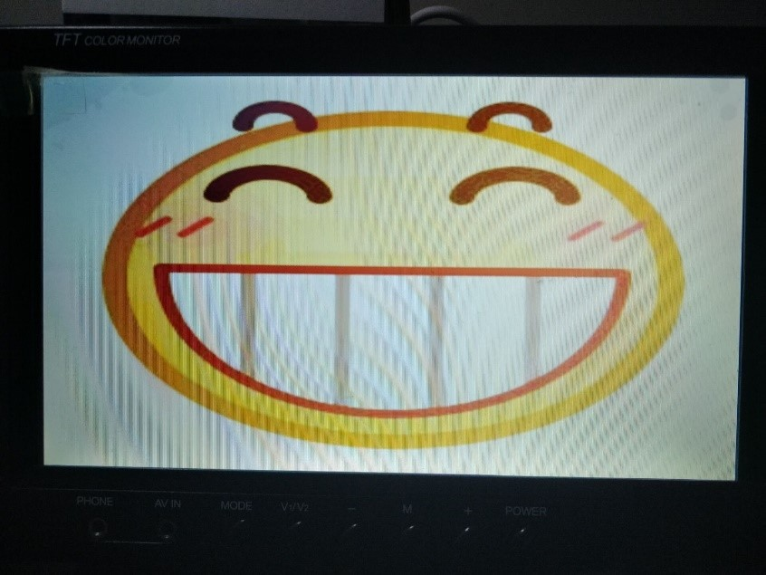

# Electronic Keyboard on FPGA

A simply simulative electronic keyboard (organ) implemented on [Nexys4 DDR board](https://reference.digilentinc.com/programmable-logic/nexys-4-ddr/start) with [Xilinx Artix-7 FPGA ](https://www.xilinx.com/products/silicon-devices/fpga/artix-7.html)(XC7A100T), with the following peripheral unit:

- VGA Display
- VS1003B MP3 Board
- PS/2 Keyboard
- Mono Audio Output (Buzzer)

